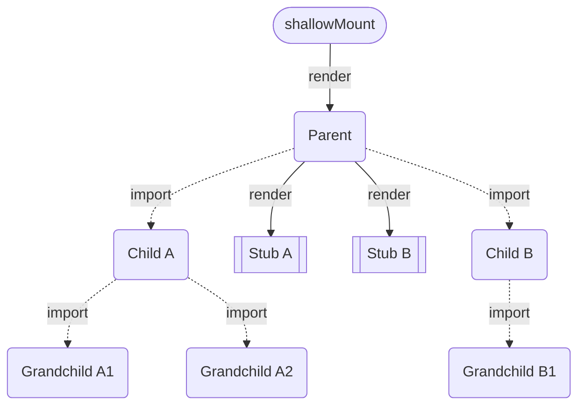
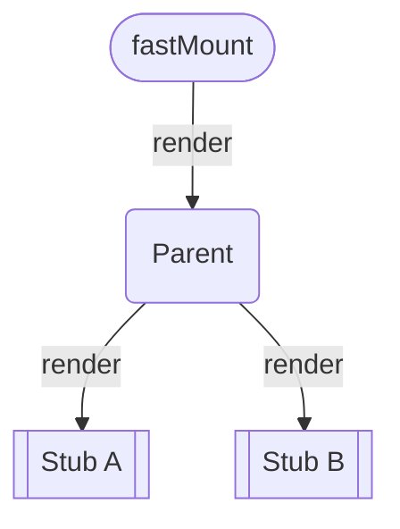

## Introduction

When [Vitest](https://vitest.dev) was first published in late 2021, I started enjoying unit testing again.
Its performance (compared to Jest and Karma) was a game-changer.
Since then, improvements to Vite, Vitest, and Vue 3 have made testing even faster.

However, in our large and complex Vue application at work, test performance started degrading over time.
For some components, test execution time exceeded 30 seconds.
The cause was the growing complexity of our application.
With every new feature, we added more components.
As a result, each test had to evaluate more imports before it could even run.
To combat this, we implemented multiple optimizations, including:

- Switching from `jsdom` to `happy-dom`.
  - Our CI did not support Vitest's browser mode.
  - This mainly affected the `environment` phase of our test runs.
- Switching from the default `forks` pool to `vmThreads`.
  - We did not run into any [OOM errors](https://vitest.dev/config/pool.html#vmthreads), even with our large test suite of 380 files.
  - This significantly reduced the `import` and `test` phases of our runs.
- Minimizing global test setup and deferring specific steps to individual tests.
  - As the name implies, this measurably improved the `setup` phase.

In the end, this reduced our test execution time in a reproducible CI environment from roughly 280 seconds to 120 seconds.
That nearly 60% reduction was significant, but performance still wasn't where we needed it for our fast, agent-supported workflow.

## Shallow attempts

At this point, our tests were written using the `mount` function from [@vue/test-utils](https://test-utils.vuejs.org/).
We used stubs here and there, but in general, our goal was to test components as close to their real behavior as possible.
Kent C. Dodds discusses this in detail in his blog post ["Why I Never Use Shallow Rendering"](https://kentcdodds.com/blog/why-i-never-use-shallow-rendering).
While I generally agree with Kent's points, our test performance was not acceptable.
While 120 seconds in CI was still acceptable (if a bit slow), running tests locally was a different story.
We started at **700 seconds** and got that down to **350 seconds** with the above optimizations.
Still, waiting almost 6 minutes to validate a change is not ideal for a fast development workflow.


We identified components with many (transitive) child components and started replacing `mount` with `shallowMount` in their respective tests.
Instead of asserting behavior of child components, we focused on testing the interactions between parent and child through props and emitted events.
This resulted in a significant performance boost, reducing local test execution time to **110 seconds** and CI execution time to **75 seconds**.

Great!
We could have stopped here, but I kept wondering if we could do better.
Vitest has a breakdown of test execution time, and I noticed that a **significant** portion of the time was spent in the `import` phase.
How significant?
Our (local) `test` phase was taking around 100 seconds (sum of all workers), but `import` took over 300 seconds!



## Breaking the chains

What was going on here?
The issue was an expectation mismatch.
While `shallowMount` replaces all child components with stubs, the components themselves (and all of their imports) are still evaluated when tests run.
We could use `vi.mock` to stub the child components, but mocking every child component manually is not a scalable solution.

In parallel, we started using [async components](https://vuejs.org/guide/components/async) for different reasons.
As a side effect, this also deferred the evaluation of the components and their imports, resulting in faster tests.
Unfortunately, using async components for faster tests was not the way to go.

But this gave me an idea.
What if we could automatically remove imports of stubbed components during tests?
This would break the chains of imports and significantly reduce the time spent on the `import` phase of our tests.



Later that day, I released the first version of [vue-fast-mount](https://github.com/DerYeger/yeger/tree/main/packages/vue-fast-mount).
Setup is straightforward.
First, install the package (`vite` and `vue` are required peer dependencies).

```bash
pnpm add -D vue-fast-mount
```

Then, add the plugin to your Vitest config.

```ts
import vue from '@vitejs/plugin-vue'
import { defineConfig } from 'vitest/config'
import { vueFastMount } from 'vue-fast-mount'

export default defineConfig({
  plugins: [vue(), vueFastMount()],
})
```

Now, within your tests, you can use the `vfm` import attribute.
Any imports using this attribute will be transformed by the plugin.

```ts
import { test } from 'vitest'
import { shallowMount } from '@vue/test-utils'
import MyComponent from './MyComponent.vue' with { vfm: 'true' }

test('...', async ({ expect }) => {
  const wrapper = shallowMount(MyComponent)
  expect(wrapper.exists()).toBe(true)
})
```

The plugin detects these `vfm` import attributes and rewrites the affected imports with additional query parameters to mark them as "fast-mount entry points".
When the plugin encounters an import marked as a "fast-mount entry point", it generates local stubs for child components used in that component's template.
Then, it omits the respective imports.
The result is a huge reduction in the time spent on the `import` phase of tests, as the chains of imports are effectively broken.

If you have specific child components that should not be stubbed, you can provide their names as a comma-separated list in the `vfm` attribute.

```ts
import { test } from 'vitest'
import { shallowMount } from '@vue/test-utils'
import MyComponent from './MyComponent.vue' with {
  vfm: 'MyChildComponent,MySecondChildComponent',
}

test('...', async ({ expect }) => {
  const wrapper = shallowMount(MyComponent, {
    global: {
      stubs: {
        MyChildComponent: false,
        MySecondChildComponent: false,
      },
    },
  })
  expect(wrapper.exists()).toBe(true)
})
```

We haven't yet had time to update all `shallowMount` tests, but the initial results are promising.
For one component with many large child components, the `import` phase dropped from **12.01 seconds to ~100 milliseconds**.
We expect similar gains for other components with many (transitive) child components.

## Footguns included

Of course, nothing comes without trade-offs.
In this case, `vue-fast-mount` cannot infer the actual names of child components, since they are not imported.
As a result, it will infer names from their template usages, which can lead to mismatches with regular `shallowMount` behavior.
For example, using an alias (e.g., `import MyCustomName from './MyComponent.vue'`) will result in the generated stub being named `MyCustomName`, while `shallowMount` would have used the actual name of the component instead.

Similarly, the props and emits of child components are unknown to the plugin.
It intelligently infers both from the usages within the template, including multiple usages with different props and emits.
However, this can still lead to mismatches, for example when alias imports are used.

Finally, the transformations performed by the plugin are well-tested, but edge cases and bugs are still possible.
Should you try out `vue-fast-mount` and run into errors, please open an issue in the [GitHub repository](https://github.com/DerYeger/yeger/issues/new?template=bug_report.yml).

## Final thoughts

Should this be used for every test?
No.
If a test is already fast, leave it alone.
But consider `vue-fast-mount` for the main components of your application.
If a component has many (transitive) child components and slow tests, this can be a great way to speed them up and improve your development workflow.
